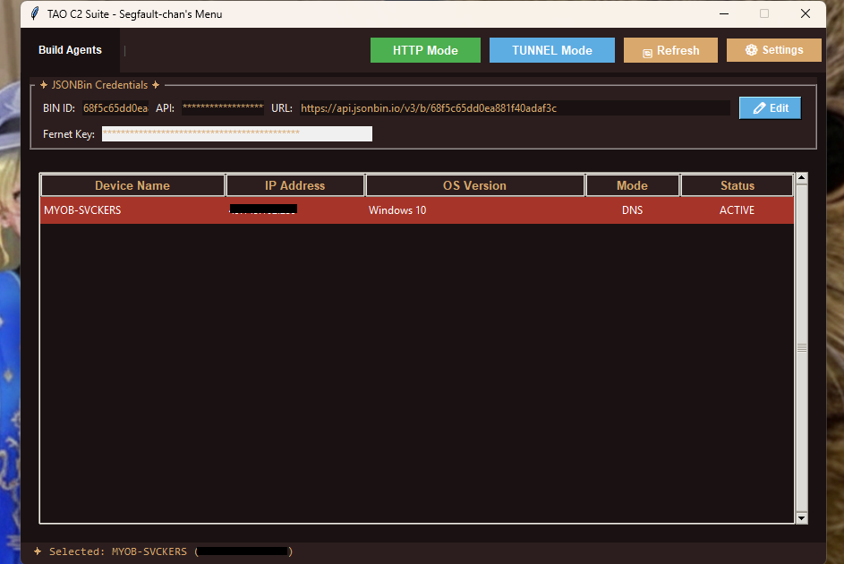
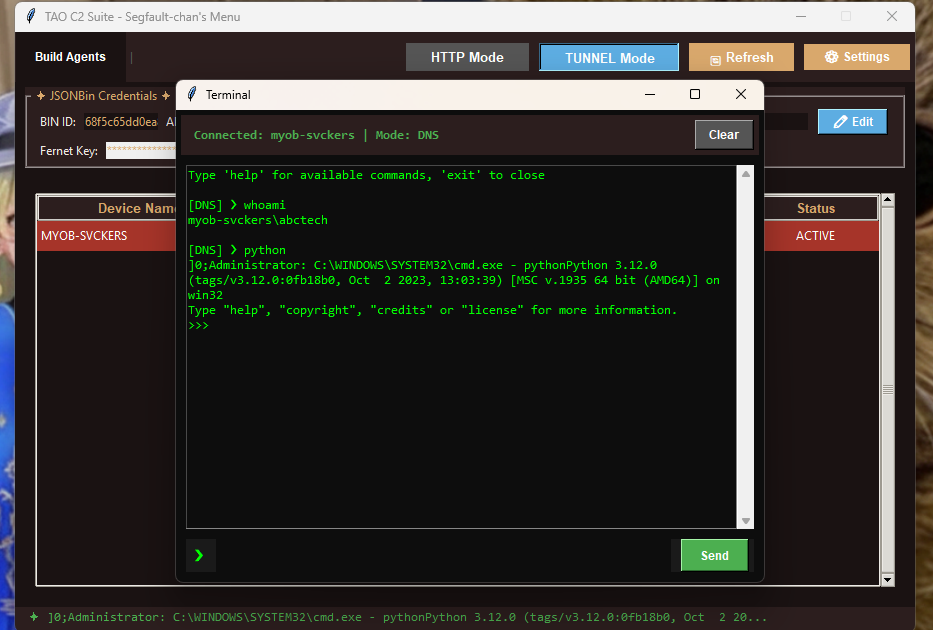
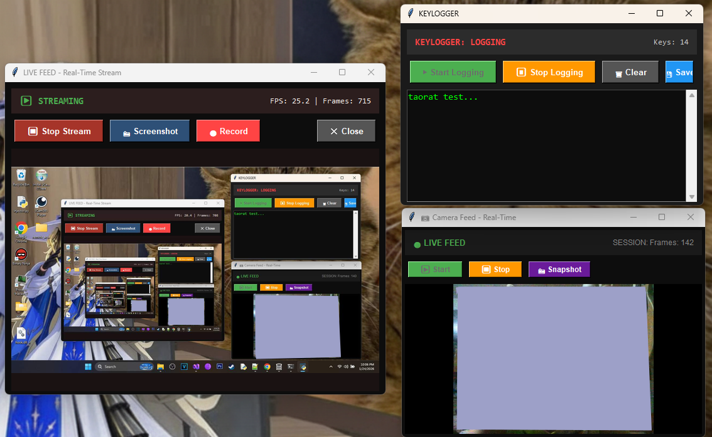
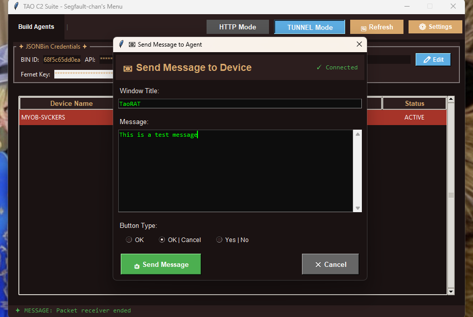
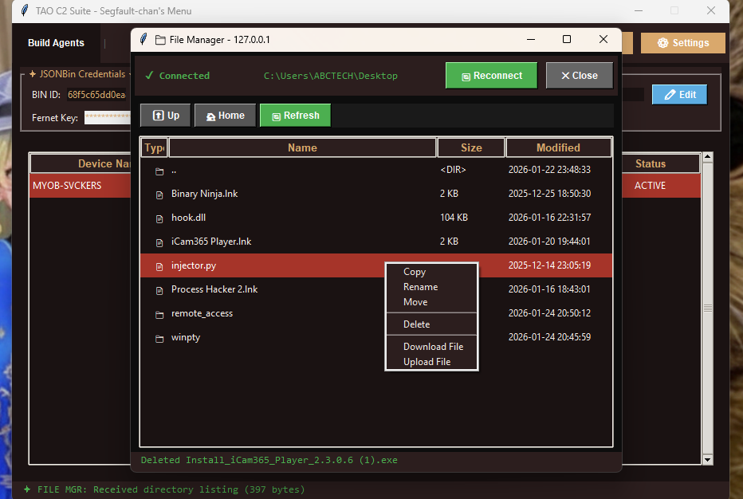
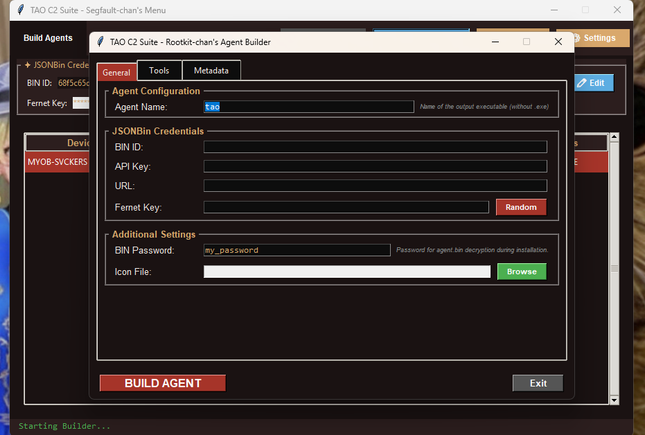
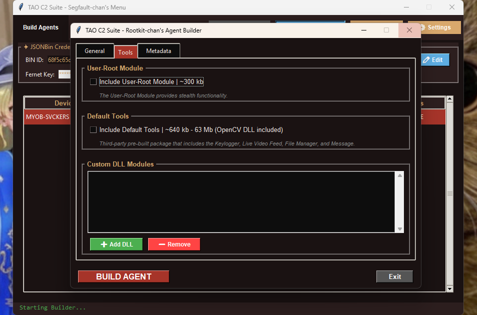
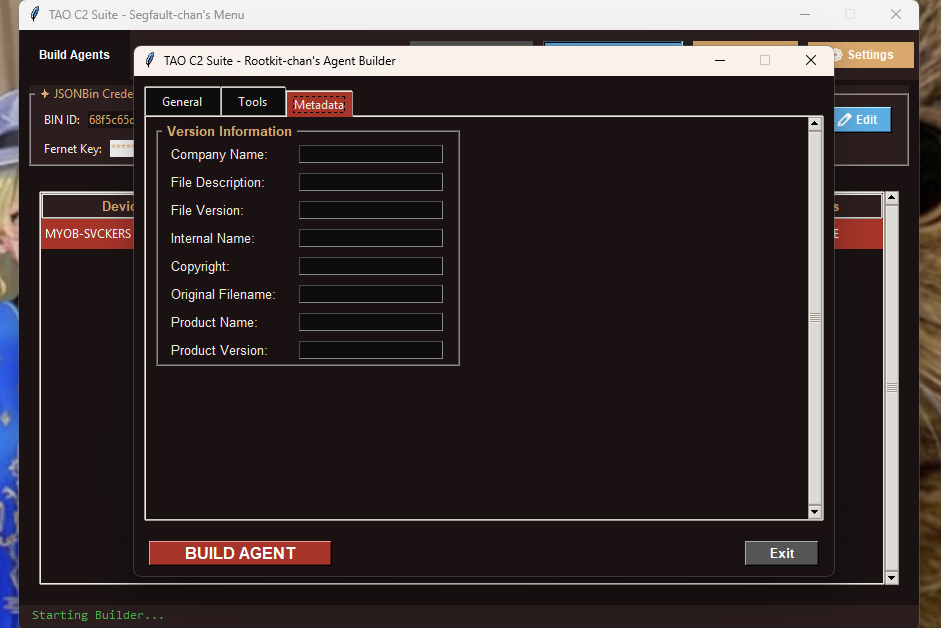

# TaoRAT
### **Open-Source Remote Administration Tool**
**TaoRAT** is a Remote Administration Tool Suite for **Windows Systems** coded in **C++** and **Python**. 

---
# Features
## | Dashboard |
#### A Python-coded controller for managing multiple agents on a one-on-one session. It supports multi-threaded polling and connection isolation for effective agent management.
** *
> #### ⚠️ **IMPORTANT** ⚠️
>To ensure the dashboard and its dependencies can communicate and run effectively, you must configure your router to allow **Port Forwarding**. Check out this comprehensive guide: [How to Forward Ports on Your Router.](https://www.portforward.com)
** *
* **Hybrid C2:** Discover and connect to agents via **HTTP** using **JSONBin.io** as **C2 Server** and **DNS Tunneling**. Both modes allow the operator to use the tool's full administration suite.
* **Bind/Reverse Connection**: The agent in **DNS Mode** <ins>opens a socket in port 53 UDP</ins> and start its own server (beacon) that initiates a connection back to the operator dashboard.
* **Windows Pseudo Console Shell:** A ConPTY-based terminal for Reverse Shelling that executes various and interactive commands *(such as powershell, python, diskpart, etc.)*.
* **Multiple Agent Management**, Isolation, and persistent tracking of agents' status, OS version, and last-seen timestamps.
* **Universal Plug and Play (UPnP)** Automatic Port Forwarding is supported.
* **Custom DLL execution** for both HTTP and Tunnel modes via the terminal shell command: `exec-<module_name>.dll`. 
##### *See the [Developer's Notes](https://github.com/r00t-tsai/TaoRAT/wiki/Create-your-own-DLL-module) on how to make your custom DLLs executable by the agent*.

## | Administration Tools |
#### Includes custom Dynamic Link Library (modules) tools that are loaded by the C++ agent via `rundll32.exe` to perform various administrative tasks.

* **Live Feed Monitoring:** Real-time screen streaming via direct TCP.
* **Webcam Monitoring:** Real-time webcam feed and microphone capture.
* **Keylogger:** Real-time global hook-based keylogger that streams keystrokes.
* **File Manager:** GUI-based file explorer to browse the remote file system, rename/move/copy files, manage directories, and download/upload files.
* **Messaging:** Send a pop-up message to the target device(s).

## | Builder |
#### An automated build utility that compiles the C++ agent and modules using MinGW64.

* **Dynamic Compilation:** Handles the encryption and compilation of the agent program and the dynamic link libraries into a single self-extracting archive with VBScript/PowerShell loaders.
* **Configuration:** Embeds C2 credentials (JSONBin/DNS) and encryption keys directly into the agent.

---

## | Setup |

##### *See the [Wiki](https://github.com/r00t-tsai/TaoRAT/wiki/) for usage and instructions*.

### Compilation
* The **Python Bootstrapper** (main.py) required these various imports: `PIL._tkinter_finder, pyaudio, cv2, dnslib, miniupnpc, enum, numpy`. You can use [PyInstaller](https://github.com/pyinstaller/pyinstaller) or [AutoPytoExe](https://github.com/brentvollebregt/auto-py-to-exe) for the compilation.
* The **C++ Agent** can be compiled by opening the `agent.sln` found in the src folder using Microsoft Visual Studio 2022+. Use **Unicode Character Set** and set the project to **Release**. Only do this if you're debugging. A separate instruction for a ready-to-deploy agent can be found [here](https://github.com/r00t-tsai/TaoRAT/wiki/Usage-and-Instructions#build).
---

> ## ⚠️ **DISCLAIMER**
> #### Do not use this software on systems you do not own or have explicit permission to test. 
> *This tool is intended for administrative purposes or authorized security testing only. Accessing any device without explicit, written permission is illegal in almost every jurisdiction (e.g., the CFAA in the US). The author assumes no liability for misuse or damage.* 

---

## | Additional Information |

### >>> | [License](https://github.com/r00t-tsai/TaoRAT/blob/main/LICENSE)| [Wiki](https://github.com/r00t-tsai/TaoRAT/wiki) |
---
## | Bug Reports |
#### Contact me: taooptimization@gmail.com | t.me/r00t_tsai